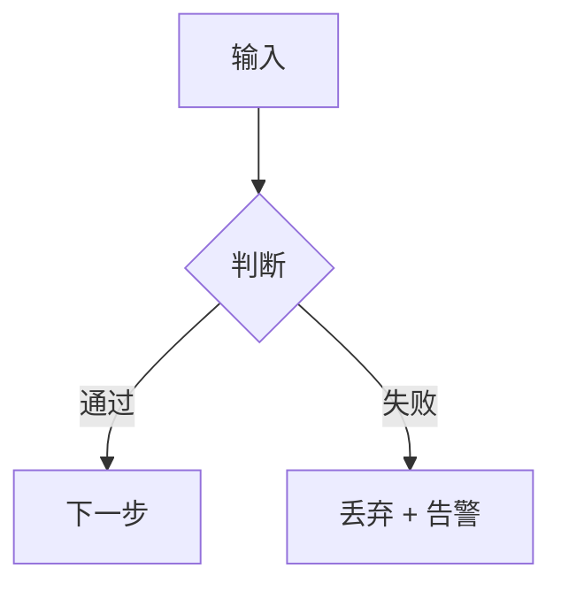

# 文档格式规范(Markdown / Obsidian)

本规范适用于所有中文技术文档。**主格式是 Markdown**,在 Obsidian 里阅读、检索、互链;
PDF 是需要时用 Obsidian(File → Export to PDF)手动导出的最终分享件,不是源。

目标:可检索(纯文本)、可链接(双链成图)、可更新(改一篇而不是生成 v2)、可被机器查询
(未来对自己的笔记做 RAG)。这正是 RAG 的形状 —— 对自己吃自己的狗粮。

> **历史说明:** 本 skill 早期产 LaTeX(`.tex` → PDF)和更早的 .docx。两套 Python 模板
> (`latex_template.py` / `docx_template.py`)仍保留为 legacy,只在用户**明确要求** .tex / .docx
> 高级排版输出时才用(见 SKILL.md「Legacy:LaTeX 路径」)。默认产 Markdown。

布局(放哪个目录、category 怎么定、reference 怎么收)见 **`VAULT_STRUCTURE.md`**。
本文件只管**一篇 md 文档内部怎么写**。

---

## 1. 设计原则

- **纯文本**:正文是干净的 Markdown,能 grep、能 diff、能喂给任何索引器。
- **结构化头**:每篇开头一段 YAML frontmatter,承载标题/日期/标签/关联(§2)。
- **可导航**:用 `#`/`##`/`###` 表达层级,Obsidian 自动生成 outline 和文档内锚点跳转。
- **成图**:双链 `[[ ]]`、`tags`、`related` 把笔记连成网(§9)。
- **会渲染的增强元素**:callout 提示框(§5)、mermaid 流程图(§6)、原生表格(§7)、
  带语言的代码块(§8)—— 这些 Obsidian 都原生渲染,是 PDF 给不了的。

---

## 2. Frontmatter(每篇必带)

文件最顶端,`---` 包裹的 YAML。这是 Obsidian 的属性面板 + 未来 RAG 的元数据来源。

```yaml
---
title: 合规审查与 LLM / RAG 结合的系统设计
subtitle: 一句副标题,具体讲了什么
date: 2026-06-02                 # 今天的真实日期(问系统,别用训练数据)
author: $DOC_AUTHOR              # 解析自环境变量(本机 settings.json),如 "Your Name (...) + Claude Code"
status: stable                   # draft | stable | superseded
type: lessons-learned            # lessons-learned | study-guide | research | note
audience: 谁该看这篇,一句话
tags:                            # 至少 2-3 个,跟 category 呼应 + 细分主题
  - rag
  - citation
  - 踩坑
aliases:                         # 可选,这篇的别名,方便 [[ ]] 时被搜到
  - 合规 RAG 架构
related:                         # 可选,强相关的几篇,帮 graph view 连边
  - "[[bota-rag-ai-ask]]"
  - "[[cosmind-spec]]"
---
```

> [!warning] `related` 只放**强主题相关**,别反射式刷屏(完整规则见 § 9 双链协议)
> 历史教训:大量不相关文档被塞了 `[[Bota AI Ask 流式响应设计]]`/`[[检索系统详解]]`,把引用网搞乱。
> **强联系测试**:"读者要理解/用好这篇,另一篇直接有帮助,因为同系统/同事件/同决策/直接依赖" →才链;
> 仅"同公司/同作者/同大方向/沾边"→不链,留空比凑数好。且 `related` **必须互链**、**不放 reference**。
> 改完跑 `check_links.py` 验。

规则:
- **`date` 用今天真实日期**,YYYY-MM-DD。不要从训练数据猜。
- **`tags` 用短词**,跟 vault 里已有 tag 对齐(别同时有 `rag` 和 `retrieval`)。
- **`title` 不带版本号**;版本交给 git。
- frontmatter 之后,正文第一行通常是 `# <一级标题>`(可与 title 一致或更口语)。

---

## 3. 标题与章节

- 用 `#` 层级表达结构:`#` 文档主标题(每篇一个)、`##` 章、`###` 节、`####` 小节。
- **不要手写章节号**。Markdown / Obsidian 不自动编号,但**手写"一、""1.1"会和 Obsidian outline、
  以及未来可能开启的自动编号插件打架**,也让标题在被 `[[#标题]]` 锚点引用时变脆。
  写 `## 合规场景为什么不能交给 LLM 单独跑`,不写 `## 一、合规场景...`。
  - 例外:如果用户**明确**就要"一、二、三"的中式编号观感,可以写,但要全篇一致。
- **文档内跳转**用 Obsidian 锚点:`[[#混合检索架构]]` 或同篇内 `[详见上文](#citation-正确性的二维分解)`。
  比硬写"见第 4 节"稳 —— 改了章节顺序链接不会过时。

---

## 4. 正文风格

- **语气**:直接、口语、技术。像资深工程师写给junior 队友 —— 没有套话、没有营销腔、
  不要"引言""结语"这种空壳标题。
- **加粗**`**...**` 标关键结论;**斜体**`*...*` 标旁注 / 元评论。
- **段落短**,一段一个意思。Markdown 段落之间空一行。
- **一段一行,不要硬折行(hard wrap)**:一个段落写成**一整行**,中途**不要**为了排版换行。
  Obsidian 默认把段落内的单换行渲染成 `<br>`,硬折行会把连续句子从中间截断。换行只用于:
  段落之间(空一行)、列表项、callout 行(`> `)、代码块。**注意**:本规范/本库文档示例本身就是一段一行,
  照着写;别学某些被硬折行污染过的旧文档。自查/批量修复:
  `python3 ${CLAUDE_SKILL_DIR}/scripts/reflow.py --check`(列出硬折行文档)、
  `reflow.py <file>`(就地合并,带结构安全校验)。
- **中文正文用全角标点**:中文句子里的逗号/句号/冒号/分号/感叹号/问号/括号,写成全角
  `，。：；！？（）`(全角自带间距,半角会让中文显得很密)。**例外**(保持半角原样):代码块、
  行内代码 `` `…` ``、英文/数字/URL、小数与版本号(`0.8.0`)、`[[wikilink]]`、`[!callout]` 语法、
  以及**标题行**(标题转了会和 `[[#锚点]]` 对不上)。括号成对:中文里包英文/代码时两端都用全角
  `（vector）`。自查/批量修复:`fullwidth.py --check` / `fullwidth.py <file>`(只转挨着中文的半角标点,带安全校验)。
- **避免**:感叹号、营销语言、对没在源文件里核实过的事下肯定结论。

---

## 5. Callout 提示框(Obsidian 原生)

Obsidian 把 `> [!type]` 渲染成带色卡片,给关键信息分级。**不要从官方全部类型里随意挑**——
本库只用下面这个**固定集合**,每个 callout 绑定**一个角色**,别让 agent 自由发挥。

> [!warning] 先搞清楚别名(官方文档证实)
> `[!important]`、`[!hint]` 都是 **`tip`** 的别名 —— 渲染成**同一个青绿火苗卡片**。所以
> **绝不能同时用 `tip` 和 `important` 表达两种意思**(它们一模一样)。本库:`important` 专表"关键决策",
> **不用** `tip`。另外:紫色卡片是 **`example`**,**不是** `important`(这点以前标错过)。

**批准集合(只用这 8 个;keyword 用官方 canonical 名):**

| keyword | 角色(何时用,一个 callout 一个用途) | 图标 · 色 |
|---|---|---|
| `abstract` | 文首一句话摘要 / TL;DR(**每篇至多一个**,放最前) | 剪贴板 · 青绿 |
| `important` | 锁定决策 / 核心纪律 / 关键结论 | 火苗 · 青绿 |
| `warning` | 坑 / 注意事项 / 容易出错处 | 三角 · 橙 |
| `danger` | 致命冲突 / 高危 / "绝对别这么做" | 闪电 · 红 |
| `failure` | 失败发现 / 此路不通 / 被否决的方案 | 叉 · 红 |
| `quote` | 引用原话(论文 / 官方文档 / 访谈) | 引号 · 灰 |
| `todo` | 待办 / 待验证(配 `- [ ]` 复选框) | 勾圈 · 蓝 |
| `note` | 补充旁注 / 背景 | 铅笔 · 蓝 |

> [!note] 其余官方类型本库不用
> `info`/`tip`/`success`/`question`/`bug`/`example`/`summary`/`tldr`/`check`/`done`/`caution`/`error`…
> —— 一律不用(避免选择困难和语义重叠)。**真要"示例"卡片**时,才破例用 `example`(紫)。

**语法 + 硬规则:**
- `> [!warning] 可选标题` 换行 `> 正文`(可多行,含加粗 / 代码 / 列表 / 表格)。
- 折叠:`> [!note]- 标题`(加 `-`)默认折叠,`+` 默认展开;长旁注用折叠。
- **一个用途一个 keyword**:`danger`(高危/别做)和 `failure`(此路不通)别混用;按上表语义选。
- **callout 标题里不加 emoji** —— callout 自带图标了(§10)。
- **别滥用**:callout 是分级工具,一篇堆太多就没了重点;正文能说清就用正文。reserve 给决策 / 坑 / 原话 / 待办。
- **自查**:`grep -roP '\[!\K[a-z]+' <vault> | sort -u` 列出全库用过的 callout 类型,核对是否都在批准集合内。

---

## 6. Mermaid 流程图(Obsidian 原生)

**流程图、架构图、时序、状态机** —— 用 ` ```mermaid ` 代码块,Obsidian 直接渲染成矢量图。
**不要再用 ASCII 线框图画流程**(`┌──┐ ▼`)—— 那是 LaTeX 时代的妥协;mermaid 更清晰、可点、能配色。



实用约定:
- **节点文字带换行**用 `<br/>`;**整段加粗**用 `<b>...</b>`(mermaid 节点里 markdown `**` 不生效)。
- **判断分支**用 `{菱形}`,边上标条件 `-- "通过" -->`。
- **并行汇合**(如 dense / sparse 两路 → RRF)直接画两条边指向同一节点,比 ASCII 的 `├─┐` 自然。
- **分组**用 `subgraph ... end`(如把编排器的多个 stage 框成一块)。
- **配色**用 `classDef` 对齐文档主题色(深蓝 `#1A365D` 作强调):
  ```
  classDef hot fill:#1A365D,color:#fff,stroke:#1A365D;
  class C hot;
  ```
- 哪些**该**画 mermaid:流程 / 管线 / 架构 / 时序 / 决策树。
  哪些**不该**:纯代码、prompt 模板、配置 —— 那些是 ` ```语言 ` 代码块(§8),不是图。

> [!note] PDF 导出
> 需要 PDF 时,直接用 **Obsidian 的 File → Export to PDF** —— 它原生渲染 mermaid、callout、
> 表格和系统字体,零配置。不要再搭 pandoc/LaTeX 那套。md 是源,PDF 是偶尔手动导出的分享件。

---

## 7. 表格

标准 Markdown 表格,Obsidian 原生渲染:

```markdown
| 维度 | 校验对象 | 失败模式 |
| --- | --- | --- |
| Existence | citation_id 是否存在 | 编造一个不存在的条款 |
| Groundedness | 引用是否**真支持**结论 | 引错条款 |
```

- 单元格里可以用 `**加粗**`、`` `代码` ``、`✓`/`✗`、emoji。
- 对齐:`:---`(左)`:---:`(中)`---:`(右),放在分隔行。
- **保持简洁**:单元格一两行;长内容拆到正文段落。
- 表格里要写竖线 `|` 字面量时转义成 `\|`(如 wikilink `[[a\|b]]` 在表格里)。

---

## 8. 代码块

用三反引号 + **语言标识**围栏,Obsidian 按语言高亮:

````markdown
```python
def hello(): ...
```
```sql
SELECT * FROM regulation_chunks WHERE is_active;
```
```typescript
const x: number = 1;
```
````

何时**标语言**、何时**留空**:

| 场景 | 推荐 |
|---|---|
| 单语言纯代码(python / ts / sql / bash / yaml / json) | **标语言** |
| 错误日志 / stack trace | **留空**(`text` 或不标,着色反而干扰) |
| prompt 模板 / 配置示意 / 目录树 | **留空**或 `text` |
| 流程 / 架构 / 时序 | **不是代码块** → 用 `mermaid`(§6) |

- 代码块里所有字符**字面输出**,不需要转义 `\ { } & % $ # < >`。
- 别写过长代码 —— 超过 ~25 行考虑拆段加说明。

---

## 9. 双链协议(可操作规则 + 检查)

双链不靠"感觉"。库里有**四种链接**,各有明确规则;写/改/移文档后用脚本检查。

**基础语法:** `[[文件名]]` / `[[文件名|显示文字]]`(按文件名解析,跨目录也行)、文档内锚点
`[[#某章]]` / `[[别篇#某章]]`、图片 `![[attachments/foo.png]]`、外部 `[文字](https://...)`
(公开网页/论文用 URL,**不**进库)。指向尚未写的笔记的 `[[ ]]` 允许(标记"待写")。

### 四种链接,各自的规则

| 链接 | 是什么 | 规则 |
|---|---|---|
| **① 层级链接(MOC)** | `_home → 域索引 → 文档`、子域上链父域 | **不手写**。由 `build_indexes.py` 自动生成(见 § 2)。文档自己不用写上链。 |
| **② `related`(frontmatter)** | 策划的 **peer 关系** | 见下三条硬规则。 |
| **③ 正文 `[[ ]]` 引用** | 单向**引用点** | 只在正文**真正提到对方内容那一句**链(如"这套体验已落地见 [[X]]")。可指知识文档或 reference。**不要求互链**(Obsidian backlinks 自动显示反向)。 |
| **④ reference 引用** | 引用私有源文档 | 在引用点写 `[[slug]]` + 确保快照存在(见 § 4)。**只走正文(③),不进 `related`**。 |

### `related` 的三条硬规则

1. **强联系测试(替代"感觉")**:只有当这句成立才链 —— **"读者要理解/用好 A,B 直接有帮助,因为
   它们是 <同系统 / 同事件 / 同决策链 / 直接依赖>"**。仅仅"同公司 / 同作者 / 同大方向 / 沾边"→**不链**。
2. **必须互链(reciprocal)**:`related` 是策划的关系,双向对称。A 列 B,则 B 也列 A。
   (同域的紧密兄弟才互链;松散的同域文档靠**共同 MOC** 归类即可,不必两两 `related`。)
3. **不放 reference、不放 MOC**:引用 reference 走正文(④);`related` 只列**同级知识文档**。宜 ≤ 4 条。

> [!tip] 正文开头的"相关:"行
> 可选的阅读面包屑。它是**引用点**(③),可含 reference 引用;不必等于 `related`。真正决定 graph
> 关系网的是 `related`(frontmatter)+ 正文 `[[ ]]` —— 两者都生成 graph 边。

### 检查流程(写/改/移文档后必跑)

```bash
python3 ${CLAUDE_SKILL_DIR}/scripts/check_links.py
```

它报告并要你修掉:
- **BROKEN** 断链(目标不存在)→ 修文件名或补笔记。
- **RELATED-ASYM** 单向 `related` → 在对方补回,或从这边删(按强联系测试判)。
- **RELATED-BADTGT** `related` 指向 reference / MOC / 不存在 → 移到正文引用,或删。
- **ORPHAN**(仅提示)进出都只有层级连接的孤立文档 → 想想要不要给它加 peer;确实没有强 peer
  (如一篇通用调研)就由它靠 MOC 连着,可接受。

---

## 10. Emoji 政策:支持,但不滥用

**一句话:Emoji 是给眼睛省工的工具,不是装饰。** 删掉它读者扫文档会变慢 → 留;否则删。

**该用:** 语义化、反复出现的标记 —— 🔵 锁定决策 / ✅ 已完成 / ❌ 未实现 / ⚠️ 警告 /
⏳ 进行中 / ⭐ 评分。状态列、checklist 里尤其值。

**不该用:** 散文里点缀;同段塞 ≥2 个不同 emoji;能用精准词代替的(别写"📅 截止日期");
意思不明确的(✨);标题层级(用 `#` 不用 emoji 前缀)。

注意:在 Obsidian 里 callout 自带图标了,callout 标题就别再加 emoji。`✓`/`✗` 在 markdown
里到处可用(不像 LaTeX 受字体限制),放心用。

---

## 11. 图片:caption 必须与图实际内容一致

从血的教训来的规则,**跨格式都适用**:把图放进文档前,**用 Read tool 实际看一遍**
那张 PNG/JPG,检查图里到底有什么,**不要相信文件名或下载来源说的"是 X 截图"**。常见错位:
营销 hero shot 被命名成 "citation.png" 实则只是 empty state;onboarding 引导页被当成 "ask sidebar"。

修正两条路:**(a)** 改说明文字如实描述图里有什么;**(b)** 图根本无关 → 删掉,正文单独表达。
**两害相权:宁可没图,也不要图 ≠ 说明。**

图片格式:Obsidian 能显示 PNG/JPG/GIF/WebP/SVG,导出 PDF 也走 Obsidian,所以格式不用特意转换。

---

## 12. 作者检查清单

写完一篇新文档,对照检查:

- [ ] 文件落在**对的 category 文件夹**里(复用优先,没有才新建 —— 见 `VAULT_STRUCTURE.md`)
- [ ] **frontmatter 完整**:title / date(今天真实日期)/ author / type / audience / tags(≥2-3)
- [ ] 标题用 `#` 层级,**没有手写"一、""1.1"章节号**
- [ ] 文档内引用用 `[[#锚点]]`,没有硬写"见第 3 节"
- [ ] callout **只用 § 5 批准集合的 8 个**(abstract/important/warning/danger/failure/quote/todo/note),一个用途一个 keyword、没滥用、标题不带 emoji
- [ ] **一段一行**,正文段落没有硬折行(`reflow.py --check` 为空)
- [ ] **中文标点全角**:正文中文标点是全角 `，。：；！？（）`(代码/英文/数字/标题除外;`fullwidth.py --check` 为空)
- [ ] 流程/架构图用 **mermaid**,不是 ASCII 线框;配色对齐主题色
- [ ] 代码块**标了语言**(日志/prompt/树形除外),长度克制(<25 行)
- [ ] 双链按 § 9 协议:`related` 是强相关 peer 且**互链**、不含 reference;reference/引用走正文 `[[ ]]`
- [ ] 已跑 `build_indexes.py`(域索引更新)+ `check_links.py`(BROKEN/ASYM/BADTGT 清零)
- [ ] 表格简洁,单元格不堆大段文字
- [ ] **图片实际内容与说明一致**(Read tool 看过每张),图放 `attachments/`
- [ ] emoji 只用在语义标记,没当装饰
- [ ] 没有营销腔、没有未经核实的肯定结论
- [ ] 引用的私有源文档已按 `VAULT_STRUCTURE.md` § 4 收进 `reference/<project>/` 并更新 `reference/reference.md`
