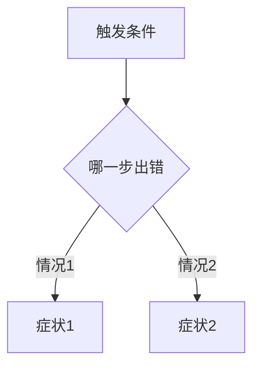

# <项目名> <场景>踩坑记

> [!abstract] 一句话
> <这次到底踩了什么坑、根因是什么、最后落到什么配置。让读者三秒抓住全貌。>

相关:[[<相关笔记>]] · [[<reference 源文档>]]

---

## 背景:这次到底在干什么

<2-3 句:我们在做什么、原本期望什么。把抽象需求落到具体场景。>

- <关键决策 / 前提 1>
- <关键决策 / 前提 2>

这份文档想达到的目的:

- 把每个错误的来龙去脉讲清楚,以后再看到类似报错知道是什么意思。
- 把过程中涉及到的技术名词从零讲一遍。
- 总结整件事的根因 + 关键教训。

---

## 技术名词速查(看后面问题之前先看这里)

后面讲问题时会反复提到下面这些词,建议先看完这一章。

### <概念 1>

<从零解释。一两段。>

### <概念 2>

<...>

---

## 问题一:<一句话症状>

**现象**:<报错信息 / 行为。原文贴在代码块里。>

```text
<把真实报错/日志贴这里,留空语言,别着色>
```

**尝试过的修法**(按时间顺序,失败的也记):

| 尝试 | 做了什么 | 结果 |
| --- | --- | --- |
| 1 | <改了什么> | ❌ <为什么没用> |
| 2 | <改了什么> | ❌ <为什么没用> |
| 3 | <改了什么> | ✅ <成了> |

> [!important] 根因
> <这条链路的真正根因。不是"试了 X 就好了",而是"为什么 X 能好、前面为什么不行"。>

---

## 问题二:<一句话症状>

<同上结构。如果问题之间有因果/流程关系,用 mermaid 画出来:>



---

## 全局教训

把单个问题之上的、可迁移的经验抽出来:

- [!important] 写法保留:**<教训 1 一句话>** —— <为什么。>
- **<教训 2>** —— <为什么。>
- **<教训 3>** —— <为什么。>

> [!tip] 可迁移的判断
> <下次遇到同类场景,应该先怀疑什么、先验证什么。这是这篇最值钱的部分。>

---

## 最终落地配置

跑通后的最终配置,完整贴出来(给未来的自己照抄):

```<语言>
<最终 working 的关键配置 / 命令 / 代码>
```

<逐项说明每个关键配置为什么是这个值。>

---

## 参考

- <私有源文档 → 收进 reference/ 并双链>:[[<doc>]]
- <公开资源 → 直接 URL>:<https://...>
