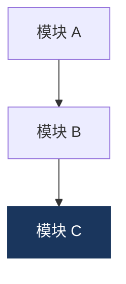
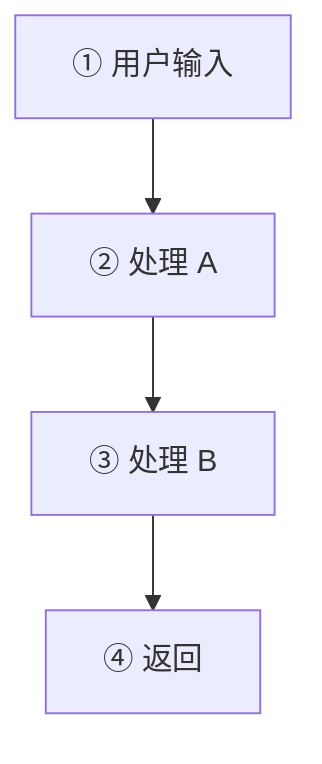

# <主题>详解

> [!abstract] 一句话
> <这套系统/技术解决什么问题、核心设计选择是什么。三秒抓住全貌。>

相关:[[<相关笔记>]] · [[<reference 源文档>]]

---

## 背景:我们到底要解决什么问题

<2-3 段:这套技术/系统为了解决什么具体问题。把抽象需求落到具体场景。>

所以选型的核心问题是:**<一句话总结决策核心>**。

---

## 为什么选 <技术 X>

### 候选方案对比

| 方案 | 是什么 | 为什么没选 / 选它 |
| --- | --- | --- |
| <候选 A> | <一句话> | ❌ <没选的原因> |
| <候选 B> | <一句话> | ❌ <没选的原因> |
| **<选中的>** | <一句话> | ✅ <选它的原因> |

> [!important] 锁定决策
> <把这个选型作为 locked decision 记下来,以及它依赖的前提 —— 前提变了才重评估。>

---

## 关键概念

按"读者需要先懂什么"的顺序,从零讲清楚每个概念。

### <概念 1>

<解释。能配图就配 mermaid。>

### <概念 2>

<...>

---

## 架构 / 模块逐个讲

整体架构先用一张 mermaid 给全貌:



### 模块 A:<职责>

<这个模块做什么、为什么这么设计、关键代码/配置。>

```<语言>
<关键代码片段>
```

### 模块 B:<职责>

<...>

---

## 请求流程 / 端到端链路

把模块串起来,走一遍真实请求:



<逐步说明每一步,标注关键时序/瓶颈。>

---

## 坑与注意事项

> [!warning] <坑 1 一句话>
> <为什么会踩、怎么避。>

> [!warning] <坑 2>
> <...>

---

## 未解决 / 下一步

> [!todo] 待验证
> - [ ] <需要实战验证的点>
> - [ ] <需要后续访谈/调研的点>

---

## 参考

- <私有源文档 → 收进 reference/ 并双链>:[[<doc>]]
- <公开资源 → 直接 URL>:<https://...>
